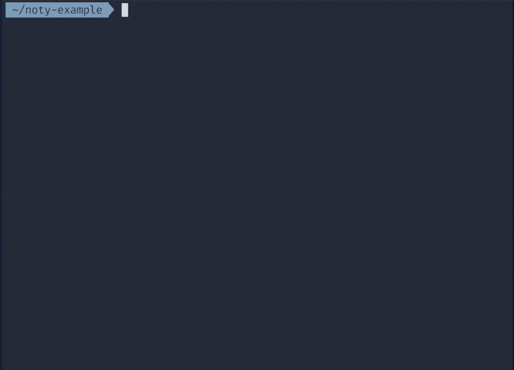

# Noty App :notebook_with_decorative_cover: 

A small note utility app created using Symfony's superb console component.

Inspired by [laracasts command line series](https://laracasts.com/series/how-to-build-command-line-apps-in-php).

## Example usage


To create new note:
```
noty new mynewnote
```

To compile into pdf:
```
noty compile examplenote.md
```

To compile into html:
```
noty compile examplenote.md --format html
```

To continuously watch for changes and compile (once every second):
```
noty watch examplenote.md
```

## Installation
Noty depends on [pandoc](https://pandoc.org/installing.html) for the markdown to
pdf/html conversion. 

For mac, this can be installed using homebrew: `brew install pandoc`.

For most linux distributions pandoc is available in your package manager. 

To use noty, make sure that the `noty` file is executable: `chmod u+x noty`. 
To have noty available *everywhere*, you can create an alias instead of adding it to your PATH: `alias noty='$HOME/path/to/noty/noty'`

## Future Areas of Improvement
- [] Scan folder for multiple markdown files and create html index page.

